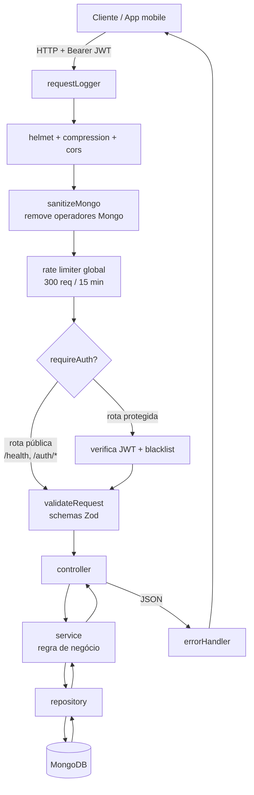

# API — Plataforma de Apoio a MEIs em Licitações Públicas (PNCP)

> Backend REST (Node.js + Express 5 + TypeScript + MongoDB) que serve o aplicativo
> mobile de apoio a Microempreendedores Individuais (MEIs) na participação em
> compras públicas amparadas pela **Lei nº 14.133/2021** (Nova Lei de Licitações).

Esta API centraliza, traduz e gerencia o ciclo de vida de uma oportunidade de
licitação: autentica o MEI, lista e detalha editais (contratações do PNCP),
calcula um **score de compatibilidade** com o CNAE da empresa, monta um
**checklist de habilitação** dinâmico, gera **alertas automáticos** de prazos e
documentos, mantém um repositório de **documentos** habilitatórios, consolida um
**dashboard** com funil de participação, e implementa os direitos do titular
previstos na **LGPD** (exportação e exclusão de dados, registro de consentimento).

---

## 1. Visão geral

O produto resolve a assimetria de informação e a barreira burocrática que afastam
os MEIs das compras públicas, em três frentes:

- **Descoberta:** centraliza editais fragmentados em portais governamentais e os
  ordena por aderência ao CNAE do usuário.
- **Tradução:** transforma o "juridiquês" do edital em um resumo simplificado,
  glossário de modalidade, elegibilidade e requisitos legíveis.
- **Gestão operacional:** checklist de habilitação, controle de documentos e
  alertas de prazo, com um dashboard de acompanhamento.

A API é o elo central do produto: consome os dados de editais já tratados pelo
pipeline de dados (ETL) e os entrega ao aplicativo mobile (React Native / Expo).

```
┌──────────────┐      grava        ┌──────────────────────────┐      lê/serve     ┌──────────────────┐
│   ETL/PNCP   │ ───────────────▶  │  MongoDB                 │ ◀──────────────── │  API (este repo) │
│ (Python)     │  contratacoes_    │  - contratacoes_limpas   │   contratações    │  Express + TS    │
│              │  limpas (upsert)  │  - users / documents...  │                   │                  │
└──────────────┘                   └──────────────────────────┘                   └────────┬─────────┘
                                                                                            │ REST/JSON + JWT
                                                                                   ┌────────▼─────────┐
                                                                                   │  App mobile      │
                                                                                   │  (React Native)  │
                                                                                   └──────────────────┘
```

---

## 2. Proposta e papel da API no produto

| Domínio | Papel da API |
| --- | --- |
| **Autenticação e segurança** | Cadastro/login por e-mail ou CNPJ, emissão e validação de JWT, hash de senha com bcrypt, recuperação de senha por token, logout com blacklist de tokens. |
| **Contratações / editais** | Lista contratações da coleção `contratacoes_limpas` (alimentada pelo ETL), aplica filtros, calcula e ordena por score de compatibilidade, enriquece o detalhe (resumo simplificado, elegibilidade, requisitos, links oficiais). |
| **Checklist de habilitação** | Gera itens de habilitação dinâmicos conforme a contratação e persiste o progresso e o status de participação do usuário. |
| **Alertas automáticos** | Sincroniza, a cada listagem, alertas de prazo de proposta, novos editais compatíveis e documentos vencidos/pendentes. |
| **Documentos** | Repositório de documentos habilitatórios por categoria, com status (ok / atenção / vencido / pendente). |
| **Dashboard** | Consolida funil de participação, histórico mensal, saúde documental e contagem de alertas/editais compatíveis. |
| **LGPD** | Exportação de dados (acesso/portabilidade), exclusão de conta com cascata (esquecimento) e registro de consentimento. |

A **proposta de negócio** completa está descrita em
[`../front-projeto-integrador/docs/project-context.md`](../front-projeto-integrador/docs/project-context.md).

---

## 3. Principais funcionalidades

### Autenticação e segurança
- Cadastro com validação rígida (CNPJ válido, CNAE de 7 dígitos, política de senha forte).
- Login por **e-mail ou CNPJ** (o sistema detecta o identificador automaticamente).
- **JWT** assinado com `issuer`/`audience`/`jti`/`exp`, carregando `sub`, `email` e `cnae`.
- **Senhas** com hash `bcrypt` (12 rounds); nunca trafegam ou são persistidas em texto.
- **Recuperação de senha** por token de uso único (SHA-256 em repouso, expira em 15 min).
  Envio por SMTP quando configurado; caso contrário, fallback de desenvolvimento.
- **Logout** com **blacklist** de tokens (coleção `revoked_tokens` com TTL).
- Resposta neutra em `forgot-password` (não revela se a conta existe).

### Contratações / editais
- Busca textual (`q`) e filtros por UF, município, modalidade, situação, faixa de valor e "somente ME/EPP".
- **Score de compatibilidade (0–100)** com o CNAE do usuário, baseado em mapa de palavras-chave por seção CNAE.
- **Ordenação por compatibilidade** sobre um pool de candidatos antes da paginação (desempate por prazo e número da compra).
- Detalhe enriquecido: resumo simplificado, glossário da modalidade, elegibilidade ME/EPP/MEI, requisitos, datas importantes, documentos exigidos e links oficiais (PNCP, sistema de origem, processo eletrônico).
- Dados de *seed* embutidos para o app funcionar mesmo com a coleção vazia (ambiente de demonstração).

### Checklist de habilitação
- Itens **derivados dinamicamente** da contratação (CNPJ ativo, regularidade fiscal/FGTS/CNDT; proposta eletrônica para pregão; atestado técnico para serviços/obras ou valor alto; declaração ME/EPP quando não exclusivo).
- Persiste itens marcados e o **status de participação** (`preparing`, `submitted`, `won`, `lost`) via upsert por usuário + contratação.

### Alertas automáticos
- Sincronizados em memória a cada listagem de alertas.
- Tipos: prazo de proposta (`proposalCritical`/`proposalSoon`/`proposalSafe`), novos editais compatíveis (`info`) e documentos (`documentExpired`/`info`).
- Filtros por status, prioridade e intervalo de datas; transições para `read`/`resolved`.

### Documentos
- Agrupados por categoria (habilitações jurídicas, regularidade fiscal, qualificação técnica).
- Status resolvido em tempo de leitura: `expired` (vencido), `pending` (sem arquivo), `attention` (vence em ≤ 30 dias), `ok`.

### Dashboard
- Funil por status de participação e histórico mensal de checklists.
- Saúde documental (% em dia), documentos vencidos/pendentes, alertas abertos e contagem de editais compatíveis.

### LGPD
- `GET /me/data-export` — exporta perfil, documentos, checklists e alertas em JSON (download).
- `DELETE /me` — exclui a conta e remove em cascata documentos, checklists, alertas e tokens de reset; revoga o token atual.
- Registro de consentimento (`acceptTerms` → `acceptedTermsAt`) e mapeamento de saída com allow-list (nunca expõe `passwordHash`).

---

## 4. Tecnologias e stack

| Tecnologia | Versão | Uso na API |
| --- | --- | --- |
| **Node.js** | `>= 22` | Runtime (`.node-version`, `engines`). |
| **TypeScript** | `^6.0.3` | Linguagem; build via `tsc` (`module`/`moduleResolution` Node16, `strict`). |
| **Express** | `^5.2.1` | Framework HTTP e roteamento. |
| **MongoDB (driver)** | `^7.2.0` | Acesso ao banco (driver oficial, sem ODM). |
| **Zod** | `^4.4.3` | Validação de entrada (body/params/query) e de variáveis de ambiente. |
| **jsonwebtoken** | `^9.0.3` | Emissão e verificação de JWT. |
| **bcryptjs** | `^3.0.3` | Hash de senhas. |
| **helmet** | `^8.1.0` | Cabeçalhos HTTP de segurança. |
| **cors** | `^2.8.6` | Política de origens cruzadas (restritiva em produção). |
| **compression** | `^1.8.1` | Compressão de respostas. |
| **nodemailer** | `^8.0.11` | Envio de e-mail (recuperação de senha) quando SMTP está configurado. |
| **dotenv** | `^17.4.2` | Carregamento de variáveis de ambiente. |
| **Vitest** | `^2.1.9` | Testes; com `supertest` para testes de rota. |
| **ts-node-dev** | `^2.0.0` | Execução em desenvolvimento com reload. |

---

## 5. Arquitetura

A API segue uma arquitetura em **camadas** com responsabilidades bem separadas:

```
routes → controllers → services → repositories → MongoDB
   ↑          ↑            ↑
schemas   (Zod)        utils / mappers / models
   └── middlewares (auth, validateRequest, sanitizeMongo, rateLimiter, errorHandler, requestLogger)
```

- **`routes/`** — definem método + path e plugam middlewares de validação por rota.
- **`controllers/`** — adaptam Request/Response, extraem `req.user`/`req.body`, chamam serviços.
- **`services/`** — regra de negócio (autenticação, score, checklist, alertas, dashboard, LGPD).
- **`repositories/`** — acesso ao MongoDB (queries, índices, upserts); única camada que toca o banco.
- **`models/`** — tipos de domínio e contratos públicos (sem expor campos internos).
- **`schemas/`** — schemas **Zod** de validação de entrada (todos `.strict()`).
- **`middlewares/`** — preocupações transversais (autenticação, validação, sanitização anti-NoSQL, rate limit, tratamento de erros, log).
- **`mappers/`** — conversão de documentos internos para a forma pública (allow-list — nunca serializa `passwordHash`).
- **`utils/`** — lógica pura e reutilizável (score de compatibilidade, builder de checklist, logger, asyncHandler).

### Fluxo de uma requisição



> Em caso de erro, qualquer camada lança/propaga para o `errorHandler`, que
> normaliza a resposta: `AppError` → status próprio; `ZodError` → `400`;
> duplicidade Mongo (E11000) → `409`; demais → `500` (sem vazar detalhes em produção).

### Conexão MongoDB resiliente

- O servidor HTTP **sobe independentemente do Mongo** (`server.ts`): se a conexão
  inicial falhar, `/health` reporta `mongo: disconnected` e há **reconexão em
  background** (intervalo de 5 s).
- A conexão usa **retentativas** configuráveis (`MONGO_CONNECT_RETRIES`,
  `MONGO_CONNECT_RETRY_DELAY_MS`) e `ServerApi v1` (strict).
- Quando o banco está indisponível, as rotas que dependem dele retornam **503
  tratado** (`Database temporarily unavailable`) em vez de derrubar o processo.
- No boot, índices são criados via `Promise.allSettled` (a falha de um não bloqueia
  os demais). A coleção de contratações é populada por serviço externo, então a
  criação de seus índices é tolerante a falha.

### Coleções utilizadas (configuráveis via env)

| Coleção (default) | Origem | Conteúdo |
| --- | --- | --- |
| `contratacoes_limpas` (`MONGO_COLLECTION`) | **ETL** (externo) | Editais/contratações do PNCP já tratados. |
| `users` (`MONGO_USERS_COLLECTION`) | API | Cadastro do MEI (perfil, CNAE, CNPJ, hash de senha, preferências). |
| `user_documents` (`MONGO_DOCUMENTS_COLLECTION`) | API | Documentos habilitatórios do usuário. |
| `contratacao_checklists` (`MONGO_CHECKLISTS_COLLECTION`) | API | Checklists e status de participação. |
| `user_alerts` (`MONGO_ALERTS_COLLECTION`) | API | Alertas gerados automaticamente. |
| `password_resets` (`MONGO_PASSWORD_RESETS_COLLECTION`) | API | Tokens de reset (hash + TTL). |
| `revoked_tokens` (`MONGO_REVOKED_TOKENS_COLLECTION`) | API | Blacklist de tokens (logout / exclusão de conta). |

O **ETL alimenta `contratacoes_limpas`** por upsert; a API apenas **lê** essa
coleção (criação de índices é best-effort). Em desenvolvimento, todos os serviços
podem apontar para o mesmo MongoDB local subido via `docker-compose` na raiz do
monorepo.

---

## 6. Referência de endpoints

Todas as respostas são JSON. Rotas protegidas exigem o cabeçalho
`Authorization: Bearer <token>`.

### Saúde

| Método | Path | Auth | Descrição |
| --- | --- | :---: | --- |
| `GET` | `/health` | — | Status da API e da conexão Mongo (`connected`/`disconnected`), uptime e timestamp. |

### Autenticação (`/auth`)

> Rate limit dedicado: `/auth/*` limitado a 20 req / 15 min; `/auth/login` ainda mais estrito (10 req / 5 min).

| Método | Path | Auth | Descrição |
| --- | --- | :---: | --- |
| `POST` | `/auth/register` | — | Cadastra usuário (nome, e-mail, CNPJ, CNAE, senha, `acceptTerms`); retorna `token` + `user`. |
| `POST` | `/auth/login` | — | Login por e-mail **ou** CNPJ + senha; retorna `token` + `user`. |
| `POST` | `/auth/forgot-password` | — | Solicita reset por `identifier` (e-mail/CNPJ); resposta neutra; envia e-mail ou retorna `resetToken` (dev). |
| `POST` | `/auth/reset-password` | — | Redefine a senha com `token` + `newPassword`. |
| `POST` | `/auth/logout` | ✓ | Revoga o token atual (blacklist). Retorna `204`. |

### Perfil e conta (`/me`)

| Método | Path | Auth | Descrição |
| --- | --- | :---: | --- |
| `GET` | `/me` | ✓ | Retorna o usuário autenticado (perfil público). |
| `PATCH` | `/me` | ✓ | Atualiza perfil (nome, e-mail, CNPJ, CNAE, preferências de notificação). |
| `DELETE` | `/me` | ✓ | **LGPD — esquecimento:** exclui a conta e dados associados em cascata. |
| `GET` | `/me/data-export` | ✓ | **LGPD — acesso/portabilidade:** baixa JSON com perfil, documentos, checklists e alertas. |
| `GET` | `/me/dashboard` | ✓ | Funil, histórico mensal, saúde documental, alertas abertos e editais compatíveis. |

### Contratações / editais (`/contratacoes`)

| Método | Path | Auth | Descrição |
| --- | --- | :---: | --- |
| `GET` | `/contratacoes` | ✓ | Lista contratações com filtros (`q`, `uf`, `municipio`, `modalidadeNome`, `status`, `valorMin`, `valorMax`, `meOnly`, `cnae`, `limit`, `skip`); ordena por compatibilidade. |
| `GET` | `/contratacoes/:id` | ✓ | Detalhe enriquecido de uma contratação (resumo, elegibilidade, requisitos, links). |
| `GET` | `/contratacoes/:id/checklist` | ✓ | Retorna o checklist de habilitação (itens derivados + progresso salvo). |
| `PUT` | `/contratacoes/:id/checklist` | ✓ | Atualiza itens marcados e/ou `participationStatus` (upsert). |

### Documentos (`/documents`)

| Método | Path | Auth | Descrição |
| --- | --- | :---: | --- |
| `GET` | `/documents/summary` | ✓ | Resumo de saúde documental (% em dia, categorias, pendentes, vencidos). |
| `GET` | `/documents` | ✓ | Lista documentos agrupados por categoria. |
| `POST` | `/documents` | ✓ | Cria um documento (nome, categoria, validade, URL do arquivo, status). |
| `PATCH` | `/documents/:id` | ✓ | Atualiza um documento. |
| `DELETE` | `/documents/:id` | ✓ | Remove um documento. Retorna `204`. |

### Alertas (`/alerts`)

| Método | Path | Auth | Descrição |
| --- | --- | :---: | --- |
| `GET` | `/alerts` | ✓ | Lista alertas (sincroniza automáticos); filtros por `status`, `priority`, `from`, `to`, `view`. |
| `PATCH` | `/alerts/:id/read` | ✓ | Marca um alerta como lido. |
| `PATCH` | `/alerts/:id/resolve` | ✓ | Marca um alerta como resolvido. |

> **Formato de erro padrão:** `{ "message": string, "details"?: ... }`.
> Erros de validação Zod retornam `400` com `details` (campo a campo).

---

## 7. Estrutura de pastas

```
api-projeto-integrador/
├── src/
│   ├── app.ts                 # Montagem do Express: middlewares globais + rotas
│   ├── server.ts              # Bootstrap: HTTP server, conexão Mongo resiliente, índices, shutdown
│   ├── config/
│   │   └── env.ts             # Validação/parse das variáveis de ambiente (Zod)
│   ├── database/
│   │   └── mongo.ts           # Conexão, ping, reconexão e acesso a coleções
│   ├── routes/                # Definição de endpoints (auth, contratacoes, documents, alerts, health)
│   ├── controllers/           # Adaptadores HTTP → serviços
│   ├── services/              # Regra de negócio (auth, jwt, email, contratacoes, checklist, alert, dashboard, document, profile)
│   ├── repositories/          # Acesso ao MongoDB + criação de índices
│   ├── models/                # Tipos de domínio e contratos públicos
│   ├── schemas/               # Schemas Zod de validação de entrada
│   ├── middlewares/           # auth, validateRequest, sanitizeMongo, rateLimiter, errorHandler, requestLogger
│   ├── mappers/               # Conversão para formas públicas (allow-list)
│   ├── utils/                 # Lógica pura: score, checklistBuilder, logger, asyncHandler, maskSensitive, auth.utils
│   ├── errors/                # AppError
│   └── types/                 # Augmentations (ex.: express.d.ts → req.user)
├── tests/                     # Vitest + supertest (alert, compatibility, rotas, maskSensitive)
├── docs/                      # SEGURANCA.md e demais documentos
├── .env.example               # Modelo das variáveis de ambiente
├── render.yaml                # Blueprint de deploy (Render)
├── tsconfig.json
├── vitest.config.ts
└── package.json
```

---

## 8. Como rodar

### Pré-requisitos
- **Node.js >= 22** e **npm >= 10** (ver `engines` / `.node-version`).
- **MongoDB** acessível (local via Docker ou MongoDB Atlas).

### Instalação
```bash
npm install
```

### Variáveis de ambiente
Copie o modelo e ajuste os valores:
```bash
cp .env.example .env
```
Veja a seção [Variáveis de ambiente](#9-variáveis-de-ambiente). O `JWT_SECRET`
deve ter **no mínimo 32 caracteres** — a API aborta o boot se a validação falhar.

### MongoDB local (Docker)
Na **raiz do monorepo** há um `docker-compose.yml` que sobe MongoDB (consumido pela
API e pelo ETL) e MySQL (camada "gold" do ETL):
```bash
docker compose up -d        # sobe os containers
# .env da API: MONGO_URI=mongodb://localhost:27017  MONGO_DB_NAME=ETL
docker compose down         # para
docker compose down -v      # para e apaga os volumes (dados)
```

### Scripts
```bash
npm run dev        # desenvolvimento com reload (ts-node-dev)
npm run build      # compila TypeScript para dist/
npm start          # executa o build (node dist/server.js)
npm run typecheck  # checagem de tipos sem emitir
npm test           # roda os testes (Vitest)
npm run test:watch # testes em modo watch
```

A API sobe por padrão em `http://localhost:3000` (configurável via `PORT`).

---

## 9. Variáveis de ambiente

Definidas e validadas em `src/config/env.ts`. Modelo completo em `.env.example`.
**Não comite segredos reais.**

| Variável | Obrigatória | Default | Descrição |
| --- | :---: | --- | --- |
| `NODE_ENV` | — | `development` | `development` \| `test` \| `production`. |
| `PORT` | — | `3000` | Porta HTTP. |
| `APP_NAME` | — | `api-projeto-integrador` | Nome da app (exposto no `/health`). |
| `LOG_LEVEL` | — | `info` | `debug` \| `info` \| `warn` \| `error`. |
| `CORS_ORIGIN` | — | `*` | Origens permitidas (lista separada por vírgula). **Em produção, evite `*`.** |
| `MONGO_URI` | ✓ | — | String de conexão do MongoDB. |
| `MONGO_DB_NAME` | ✓ | — | Nome do banco. |
| `MONGO_COLLECTION` | ✓ | — | Coleção de contratações (ex.: `contratacoes_limpas`, alimentada pelo ETL). |
| `MONGO_USERS_COLLECTION` | — | `users` | Coleção de usuários. |
| `MONGO_DOCUMENTS_COLLECTION` | — | `user_documents` | Coleção de documentos. |
| `MONGO_CHECKLISTS_COLLECTION` | — | `contratacao_checklists` | Coleção de checklists. |
| `MONGO_ALERTS_COLLECTION` | — | `user_alerts` | Coleção de alertas. |
| `MONGO_PASSWORD_RESETS_COLLECTION` | — | `password_resets` | Coleção de tokens de reset. |
| `MONGO_REVOKED_TOKENS_COLLECTION` | — | `revoked_tokens` | Blacklist de tokens. |
| `MONGO_CONNECT_RETRIES` | — | `5` | Tentativas de conexão no boot. |
| `MONGO_CONNECT_RETRY_DELAY_MS` | — | `2000` | Intervalo entre tentativas (ms). |
| `JWT_SECRET` | ✓ | — | Segredo do JWT (**mín. 32 caracteres**). |
| `JWT_EXPIRES_IN` | — | `1h` | Validade do token. |
| `JWT_ISSUER` | — | `api-projeto-integrador` | `iss` do token. |
| `JWT_AUDIENCE` | — | `front-projeto-integrador` | `aud` do token. |
| `SMTP_HOST` / `SMTP_PORT` / `SMTP_USER` / `SMTP_PASS` / `SMTP_FROM` | — | — | SMTP **opcional** para recuperação de senha por e-mail. Sem isso, usa o fallback (token em dev + log). |
| `SMTP_SECURE` | — | — | `true` \| `false` (TLS). |
| `PASSWORD_RESET_URL_BASE` | — | — | Base do link de reset enviado por e-mail. |

---

## 10. Segurança

Resumo (detalhes completos em [`docs/SEGURANCA.md`](docs/SEGURANCA.md), que cobre os
requisitos 1 a 6 e o mapeamento ao OWASP Top 10 e à LGPD):

- **Autenticação e senhas:** JWT com `issuer`/`audience`/`jti`/expiração; senhas
  com `bcrypt` (12 rounds); rate limit dedicado em `/auth` e `/login`; reset por
  token de uso único (hash SHA-256, expira em 15 min); logout com blacklist.
- **Dados em repouso / anonimização:** criptografia em repouso é responsabilidade
  de infraestrutura (Atlas); minimização de dados e mapper de saída por allow-list
  (nunca expõe `passwordHash`).
- **LGPD (direitos do titular):** exportação (`/me/data-export`), exclusão em
  cascata (`DELETE /me`) e registro de consentimento (`acceptTerms`).
- **Proteção contra ataques:** `helmet`, CORS restritivo em produção, sanitização
  anti-NoSQL-injection, validação Zod `.strict()`, limite de payload (100 kb),
  rate limit global e tratamento de erro que não vaza detalhes em produção.
- **Backup e continuidade:** estratégia recomendada (MongoDB Atlas) e runbook de
  restauração documentados.
- **Gestão de fornecedores:** inventário de sub-processadores e política de
  auditoria de dependências.

---

## 11. Deploy

Configurado em [`render.yaml`](render.yaml) (Render, web service Node):

- **Build:** `npm ci --include=dev && npm run build && npm prune --omit=dev`.
- **Start:** `npm start` (`node dist/server.js`).
- **Health check:** `healthCheckPath: /health`.
- **`autoDeploy: false`** (deploy disparado manualmente).
- **Segredos via `sync: false`** (definidos no painel do Render, fora do repositório):
  `CORS_ORIGIN`, `MONGO_URI`, `MONGO_DB_NAME`, `MONGO_COLLECTION`,
  `MONGO_USERS_COLLECTION`, `JWT_SECRET`. As demais variáveis (não sensíveis) já têm
  valor definido no blueprint.

Ver também [`docs/render-deploy.md`](docs/render-deploy.md).

---

## 12. Documentação relacionada

- [`docs/SEGURANCA.md`](docs/SEGURANCA.md) — segurança e privacidade (requisitos 1–6, OWASP, LGPD).
- [`IMPLEMENTACAO.md`](IMPLEMENTACAO.md) — notas de implementação (checklist, ordenação por compatibilidade, dashboard, correções P0).
- [`docs/authentication-and-security.md`](docs/authentication-and-security.md) — detalhes de autenticação.
- [`docs/front-integration-context.md`](docs/front-integration-context.md) — contexto de integração com o app mobile.
- [`docs/render-deploy.md`](docs/render-deploy.md) — guia de deploy no Render.
- [`../front-projeto-integrador/docs/project-context.md`](../front-projeto-integrador/docs/project-context.md) — proposta de produto e de negócio.
- [`../README.md`](../README.md) — README do monorepo (integra ETL + API + app).
